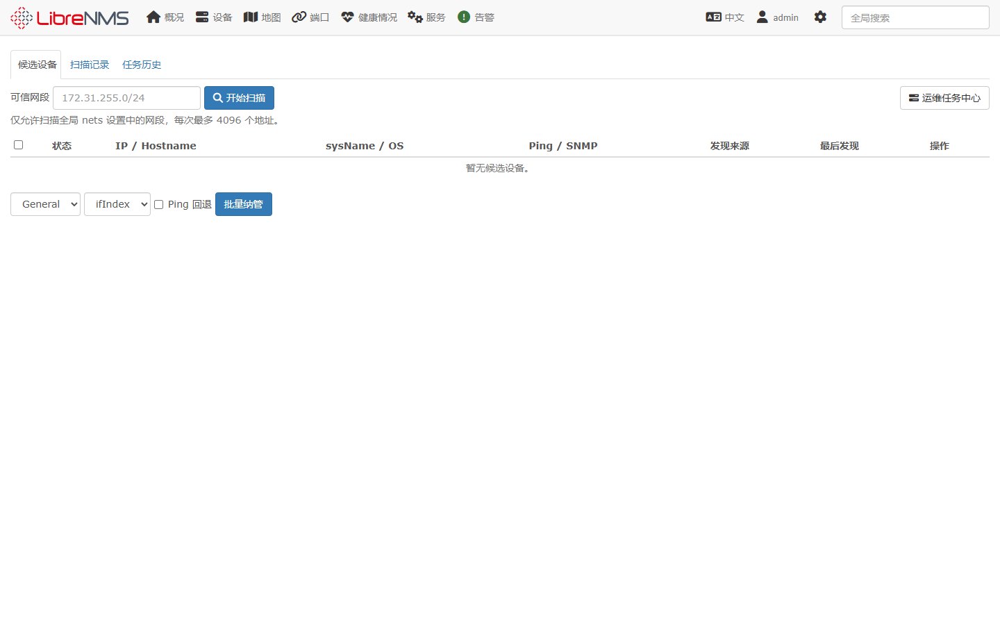
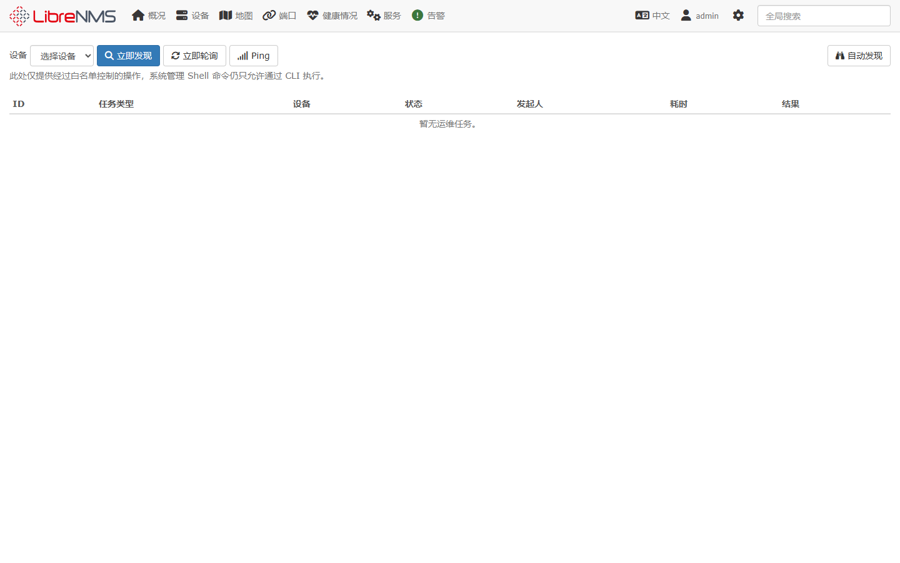

# LibreNMS 园区网络部署与运维操作手册

本文适用于 `26.5.1-custom` 分支，覆盖 Windows 11、WSL2、Docker
Compose、Containerlab 园区实验、设备发现审批、拓扑感知、监控和告警。

## 1. 架构与地址

实验拓扑为核心、汇聚、接入三层：

| 层级 | 节点 | 管理地址 | 说明 |
| --- | --- | --- | --- |
| 管理 | LibreNMS | `172.31.255.2` | Docker Compose |
| 核心 | core01 | `172.31.255.11` | Huawei CE12800 VRP 8.180 |
| 汇聚 | agg01 | `172.31.255.21` | Huawei CE12800 VRP 8.180、OSPF |
| 接入 | access11-access12 | `172.31.255.31-32` | Huawei CE12800 VRP 8.180、VLAN Trunk |

SNMP v2c 团体字为 `librenms-lab`，只用于隔离的实验网络。生产环境应使用
SNMPv3，并通过访问控制限制 LibreNMS 管理地址。

## 2. Windows、WSL2 与 Docker

以管理员 PowerShell 执行：

```powershell
Set-ExecutionPolicy -Scope Process Bypass
.\containerlab\scripts\install-wsl.ps1
```

重启后进入 Ubuntu 24.04，确认 Docker Desktop 已启用该 WSL2 发行版集成，再执行：

```bash
cd /mnt/e/vscode/librenms
docker version
```

在 Docker Desktop 设置中开启 Ubuntu 24.04 的 WSL Integration。部署脚本会在
Docker Desktop 引擎内运行特权 Containerlab 容器，以便正确创建虚拟链路；无需在
Ubuntu 中单独安装 Containerlab。

构建并启动自有 LibreNMS 镜像：

```powershell
docker compose -f docker/compose.yml -f docker/compose.dev.yml build librenms
docker compose -f docker/compose.yml up -d
docker compose -f docker/compose.yml ps
```

浏览器访问 `http://localhost:8000/`。首次部署完成管理员创建和数据库初始化。

## 3. CE12800 镜像与园区拓扑

当前拓扑默认使用 Docker Hub 镜像
`windddkz/huawei_vrp:ce12800-8.180`。该镜像包含虚拟机软件，使用前请确认镜像来源和
授权符合你的组织要求。进入 WSL2 执行：

```bash
cd /mnt/e/vscode/librenms
docker pull windddkz/huawei_vrp:ce12800-8.180
./containerlab/scripts/up.sh
```

`up.sh` 会依次检查 KVM、构建轻量汇聚/接入节点、部署 Containerlab、将 LibreNMS
接入 `campus-mgmt`，并从 LibreNMS 容器验证 4 个节点的 SNMP。CE12800 首次启动通常
需要数分钟；脚本出现 `SNMP WAIT` 时可稍后执行：

```bash
./containerlab/scripts/status.sh
docker compose -f docker/compose.yml -f containerlab/compose.override.yml \
  exec librenms snmpget -v2c -c librenms-lab 172.31.255.11 SNMPv2-MIB::sysName.0
```

如需临时使用其他镜像标签，可在命令前设置 `CE_IMAGE`，无需修改拓扑文件。

四台 VRP 的管理服务同时发布到 Windows 宿主机，便于从宿主机直接调试：

| 节点 | SSH | SNMP/UDP | HTTP | HTTPS | NETCONF |
| --- | ---: | ---: | ---: | ---: | ---: |
| core01 | `2201` | `16101` | `8001` | `8441` | `8301` |
| agg01 | `2202` | `16102` | `8002` | `8442` | `8302` |
| access11 | `2211` | `16111` | `8011` | `8451` | `8311` |
| access12 | `2212` | `16112` | `8012` | `8452` | `8312` |

例如，从宿主机读取核心设备：

```powershell
ssh -p 2201 admin@127.0.0.1
snmpget -v2c -c librenms-lab 127.0.0.1:16101 SNMPv2-MIB::sysName.0
```

LibreNMS 不经过这些宿主端口，而是通过共享管理网络直接访问
`172.31.255.11/21/31/32:161/udp`。

销毁实验拓扑：

```bash
./containerlab/scripts/destroy.sh
```

## 4. 网络协议检查

核心至汇聚使用 `10.255.0.0/31`，运行 OSPF Area 0。
汇聚承载 VLAN 110、120。

常用检查：

```bash
docker exec -it clab-huawei-campus-agg01 vtysh -c "show ip ospf neighbor"
docker exec -it clab-huawei-campus-agg01 lldpcli show neighbors
docker exec -it clab-huawei-campus-agg01 bridge vlan show
snmpget -v2c -c librenms-lab 172.31.255.21 SNMPv2-MIB::sysName.0
```

如果 OSPF 邻居未建立，先检查链路接口地址和接口状态；如果拓扑无链路，检查两端
LLDP 是否开启以及 LibreNMS 是否已经完成一次设备发现。

## 5. 自动发现与审批

在全局设置的“自动发现”中配置 `nets`，例如：

```text
172.31.255.0/24
```

排除网段继续使用 `autodiscovery.nets-exclude`。Web 扫描必须完全位于 `nets`
中，每次最多 4096 个地址。

进入“设备 > 自动发现”：

1. 在“可信网段”中输入 CIDR，点击“开始扫描”。
2. 在“扫描记录”查看排队、执行、进度和错误。
3. 在“候选设备”核对 IP、sysName、OS、Ping、SNMP 和发现来源。
4. 点击“纳管”，设置 Hostname、Poller Group、端口关联模式。
5. SNMP 不可用且只需 Ping 监控时，显式启用“Ping 回退”。
6. 批量选择候选设备后可以统一纳管。
7. “忽略”会持续保留忽略状态；需要重新评估时点击“恢复”。



LLDP、CDP、FDP、OSPF、OSPFv3、BGP 等官方自动发现入口在审批模式下也只会写入
候选池。关闭 `autodiscovery.require_approval` 后才恢复官方直接纳管行为。

候选表不保存 Community、SNMPv3 用户或密码。点击纳管时，系统重新读取全局 SNMP
设置并调用 LibreNMS 原生验证流程。

## 6. 拓扑感知

设备纳管后先执行一次“立即发现”，再进入“地图 > 网络”检查链路。拓扑依赖：

- 两端设备均已纳管。
- LLDP/CDP/FDP 发现模块已启用。
- 接口索引和端口关联模式稳定。
- 轮询器可访问设备管理地址和 SNMP。

链路缺失时依次检查设备事件记录、发现日志、邻居表和端口状态。不要通过手工编辑
数据库补链路，先修复协议或设备标识。

## 7. 设备、端口、图形与日志

在设备详情页重点检查：

- 概况：在线状态、硬件、版本、运行时间。
- 端口：状态、速率、双工、流量、错误、描述。
- 健康状况：CPU、内存、温度、电源和风扇。
- 图形：Bits、单播包、非单播包、错误和 Ping 性能。
- 日志：事件记录、Syslog、宕机记录。

首次纳管后图形需要至少两个轮询周期才会形成趋势。端口计数异常时先确认 SNMP
视图、设备 MIB 和端口关联模式。

### 7.1 端口存在但图形显示 No Data

端口清单由 discovery 写入数据库，流量计数和 `port-id*.rrd` 文件由 poller
周期性生成。因此“能看到端口”只说明发现成功，不能证明轮询器正常。页面显示
`No Data file port-idXX.rrd` 时按以下顺序检查：

```powershell
$dc = "docker compose -f docker/compose.yml -f containerlab/compose.override.yml"

# dispatcher 必须为 Up，日志中应持续出现 Polling device 和 completed
Invoke-Expression "$dc ps"
Invoke-Expression "$dc logs --tail 200 dispatcher"

# 将 4 替换为设备 ID；调试时只执行 ports 模块
Invoke-Expression "$dc exec -T -u librenms librenms php poller.php -h 4 -m ports -d"

# 将地址替换为目标设备，确认端口 RRD 已创建
Invoke-Expression "$dc exec -T librenms sh -lc 'ls -l /data/rrd/172.31.255.11/port-id*.rrd'"
```

还应在数据库或调试输出中确认设备 `last_polled`、端口 `poll_time`、
`ifInOctets` 和 `ifOutOctets` 持续更新。首次轮询只创建数据源，至少等待两个
完整轮询周期；实验链路没有业务流量时，图形会是正常的 0 bps 平线。

本项目曾出现 dispatcher 日志报
`env: 'python3\r': No such file or directory`。这是 Windows CRLF 进入镜像中的
shebang 脚本，导致 poller 根本没有运行。`docker/Dockerfile.huawei` 已在构建时
统一清理 shebang 行的 CR；再次出现时执行：

```powershell
docker compose -f docker/compose.yml build --no-cache librenms
docker compose -f docker/compose.yml -f containerlab/compose.override.yml `
  up -d --force-recreate librenms dispatcher operations-worker snmptrapd
docker compose -f docker/compose.yml -f containerlab/compose.override.yml `
  logs --tail 200 dispatcher
```

如果轮询正常但计数取不到，再用 `snmpget/snmpwalk` 检查 IF-MIB 的
`ifHCInOctets`、`ifHCOutOctets`、`ifInOctets` 和 `ifOutOctets`，并检查 Huawei
SNMP MIB view 是否允许访问这些 OID。

## 8. 告警规则与传送

在“告警”菜单中依次配置：

1. 告警规则：定义设备、端口、传感器或协议条件。
2. 告警模板：设置通知正文和恢复正文。
3. 告警传送：配置邮件、Webhook 等目标。
4. Operations：设置升级步骤、重复间隔和传送组合。
5. 定期维护：在变更窗口内抑制计划内告警。

创建规则后先使用规则预览确认匹配设备，再启用通知。生产环境应先在测试传送目标上
验证恢复通知和重复通知行为。

## 9. 告警监控与故障定位

“通知”显示当前告警，“告警历史”用于审计状态变化。处理流程：

1. 核对时间、规则、设备、位置和消息。
2. 查看设备可用性、端口状态和对应性能图形。
3. 查看事件记录、Syslog、Trap 和发现/轮询日志。
4. 确认告警并填写处置说明。
5. 故障恢复后确认恢复事件和通知已经产生。

确认只代表运维人员已接手，不会改变设备状态或强制关闭告警。

## 10. Web 运维任务中心

“设备 > 运维任务中心”提供受控操作：

- 立即发现设备。
- 立即轮询设备。
- Ping 连通性检测。
- 查看发起人、状态、耗时、结果和错误摘要。

任务由独立 `operations` 队列执行，不阻塞 Web 请求。只有具有设备创建权限的管理员
可以发起扫描、审批和任务。



## 11. 必须使用 CLI 的操作

以下操作影响范围大或需要交互式诊断，不在 Web 中开放：

- LibreNMS 升级、数据库迁移和回滚。
- 插件安装、升级和生命周期管理。
- 原始 `snmpwalk`、MIB 调试和抓包。
- 数据库维护、备份恢复和批量修复。
- 任意 Artisan、Shell 命令或高级 `config:set`。

这项限制避免 Web 权限被扩展为主机命令执行权限，并保留完整终端审计记录。

## 12. 与 Oxidized 集成

Oxidized 通过 LibreNMS API 获取设备清单，再通过共享的 `campus-mgmt` 网络直接
访问设备管理地址的 TCP/22。它不使用宿主机映射的 SSH 端口。当前 Huawei VRP
设备模型为 `vrp`，备份结果保存在 `oxidized-output` 命名卷中的 Git 仓库。

1. 在 LibreNMS 的“API > API 设置”中为专用账号创建令牌。
2. 在本机 `docker/.env` 设置以下值，不要把真实密码或令牌提交到 Git：

```dotenv
OXIDIZED_USERNAME=admin
OXIDIZED_PASSWORD=change-me
OXIDIZED_API_TOKEN=replace-with-librenms-api-token
```

生产环境应使用只读设备账号、独立 LibreNMS API 账号和 SSH 密钥。实验环境默认
账号仅用于验证流程。

启动 Oxidized 并启用 LibreNMS 集成：

```powershell
$dc = "docker compose -f docker/compose.yml -f containerlab/compose.override.yml"
Invoke-Expression "$dc --profile oxidized up -d oxidized"

Invoke-Expression "$dc exec -T -u librenms librenms php artisan config:set oxidized.enabled true"
Invoke-Expression "$dc exec -T -u librenms librenms php artisan config:set oxidized.url http://oxidized:8888"
Invoke-Expression "$dc exec -T -u librenms librenms php artisan config:set oxidized.features.versioning true"
Invoke-Expression "$dc exec -T -u librenms librenms php artisan config:set oxidized.reload_nodes true"
```

`docker/oxidized/config` 从
`http://librenms:8000/api/v0/oxidized` 获取设备，REST 服务监听
`0.0.0.0:8888`。验证节点状态和备份结果：

```powershell
Invoke-Expression "$dc --profile oxidized logs --tail 200 oxidized"
Invoke-RestMethod http://localhost:8888/nodes.json |
  Select-Object name, model, status, time

Invoke-Expression "$dc --profile oxidized exec -T oxidized sh -lc `
  'git --git-dir=/home/oxidized/.config/oxidized/output/configs.git log --oneline --all -8'"
```

日志出现 `Loaded 4 nodes`、每台设备状态为 `success`，且 Git 仓库中存在四个管理
地址文件后，LibreNMS 设备页的配置和版本差异功能即可使用。

| Oxidized 现象 | 检查 |
| --- | --- |
| API 返回 401/403 | `OXIDIZED_API_TOKEN` 是否有效，API 账号是否仍启用 |
| `librenms:80` 拒绝连接 | 容器内 Web 端口是 `8000`，源 URL 必须使用该端口 |
| `Loaded 0 nodes` | API 响应、设备 OS/model 映射和 `oxidized.enabled` |
| LibreNMS 无法连接 Oxidized | REST 必须监听 `0.0.0.0:8888`，两容器需在默认网络 |
| SSH 超时或认证失败 | Oxidized 是否加入 `campus-mgmt`、设备 TCP/22、账号和 VRP AAA |
| 没有配置版本 | 检查 `output.git.repo`、命名卷权限和 Oxidized 日志 |

## 13. 备份、升级与镜像重建

备份数据库和持久化卷：

```powershell
docker compose -f docker/compose.yml exec db mariadb-dump -ulibrenms -plibrenms librenms > librenms.sql
docker run --rm -v librenms_librenms-data:/data -v ${PWD}:/backup alpine \
  tar czf /backup/librenms-data.tgz -C /data .
```

升级时从新的官方 Tag 创建升级分支，逐个迁移自定义提交并运行测试，不要将旧分支完整
覆盖到新版本。重建：

```powershell
docker compose -f docker/compose.yml build --no-cache librenms
docker compose -f docker/compose.yml up -d --force-recreate
docker compose -f docker/compose.yml logs --tail 200 librenms operations-worker
```

## 14. 常见故障

| 现象 | 检查 |
| --- | --- |
| 页面 HTTP 500 | `docker compose logs librenms`、迁移状态、缓存和文件权限 |
| 扫描一直排队 | `operations-worker` 是否运行、数据库队列是否可用 |
| 扫描被拒绝 | CIDR 是否完全位于 `nets`、是否命中排除网段、是否超过 4096 |
| 纳管失败 | Ping、SNMP、重复 Hostname/sysName、全局凭据 |
| 拓扑无链路 | LLDP/CDP、两端纳管状态、发现任务、端口关联模式 |
| 图形无数据 | 检查 dispatcher、`last_polled`、`poll_time`、端口 RRD 和 SNMP 计数 |
| `python3\r` | Windows CRLF 破坏 shebang；无缓存重建镜像并重建 poller 容器 |
| Oxidized 无配置 | 检查 API 令牌、共享管理网、SSH、VRP model 和 Git 输出目录 |
| Huawei Trap 只有 OID 或显示未处理 | 检查 snmptrapd 的 `-m ALL`、Huawei MIB 搜索路径、Trap 模块清单和 handler 映射 |
| LLDP Trap 正常但接口 Trap 没有 | 检查 IFNET 的 `linkdown/linkup` 是否为 `on`，并确认测试接口的运行状态确实发生变化 |
| CE12800 启动慢 | 检查 KVM、内存、CPU 虚拟化；首次启动可能需要较长时间 |

关键页面截图存放在 `docs-custom/assets/`，用于版本发布前复核界面和手册描述。

## 15. Huawei MIB 更新

当前 Huawei 生效集位于宿主机 `mibs/huawei`，镜像内路径为
`/opt/librenms/mibs/huawei`。`SNMP_EXTRA_MIB_DIRS` 已指向该目录。厂家包版本记录在
`mibs/huawei-source-version.txt`，模块及哈希记录在
`mibs/huawei-manifest.json`。

未来收到新 MIB 包时，不能只把文件复制到目录后重启容器。必须依次完成：

1. 记录原始 ZIP 的版本和 SHA-256，并保留旧版用于回滚。
2. 使用 `scripts/huawei-mib-workflow.php import` 导入 Huawei 私有模块。
3. 审计新增、删除及变更的 OID、Trap 和 VarBind。
4. 执行 `audit`，重新生成 manifest、Trap 模块清单与 Handler 全量映射。
5. 检查 discovery、polling、OS 定义和 Trap handler 是否需要同步适配。
6. 重建 `librenms` 镜像，并强制重建 `librenms`、`dispatcher`、
   `operations-worker`、`snmptrapd`。
7. 对比宿主和容器内文件数量、关键文件 SHA-256，运行 `snmptranslate`、
   discovery、poller 和 Trap 回归。

Trap 支持分为三个层次：

1. MIB 解析：snmptrapd 使用 Huawei 目录把数字 OID 翻译为模块和符号名称。
2. 通用 Huawei 处理：没有专用映射的 Huawei Trap 仍会结构化写入 Eventlog，
   并按 Alarm/Down/Failure、Warning、Resume/Recovery/Clear/Up 推断严重性。
3. 专用状态处理：接口 Up/Down、环路检测等 Trap 由专用 handler 更新对应端口
   或对象状态。新增 MIB 并不会自动获得这一层语义。

普通 GE 业务接口的 Up/Down 使用标准 `IF-MIB::linkDown/linkUp`。Huawei VRP 默认可能
关闭这两个 IFNET 通知，必须检查并启用：

```text
display snmp-agent trap feature-name ifnet all
system-view
snmp-agent trap enable feature-name ifnet trap-name linkdown
snmp-agent trap enable feature-name ifnet trap-name linkup
commit
```

实验环境的接收目标为：

```text
snmp-agent target-host trap address udp-domain 172.31.255.99 source MEth0/0/0 vpn-instance __MGMT_VPN__ params securityname librenms-lab v2c
```

`hwPhysicalAdminIfDown/Up` 的 MIB 描述针对物理管理接口语义，不能替代普通 GE 口的
标准链路通知。另需注意，`linkDown/linkUp` 只在 `ifOperStatus` 变化时发送：没有接线的
空闲口即使执行 `undo shutdown`，运行状态仍为 Down，也不会产生 `linkUp`。验证时应在
有物理链路的接口上执行 `shutdown`、`commit`、`undo shutdown`、`commit`，并在事件记录
中确认 `SNMP Trap: linkDown` 和 `SNMP Trap: linkUp`。

`mibs/huawei-trap-modules.list` 不是手工白名单，而是从全部 Huawei MIB 的
`NOTIFICATION-TYPE` 自动生成。更新 MIB 后必须重新生成并纳入差异审计。
`mibs/huawei-trap-handler-map.json` 则穷举每个唯一通知最终命中的专用 Handler
或 `HuaweiGenericTrap`，可直接用于检查新增 MIB 是否已经进入处理链。

当前基线的 6676 条定义去重后为 6670 个通知：13 个命中专用 Handler，6657 个进入
`HuaweiGenericTrap`。选择顺序是“精确映射 > Huawei 通用 Handler > 原有 fallback”。
因此 `hwPhysicalAdminIfDown/Up` 可更新对应物理管理接口状态，普通业务接口由标准
`linkDown/linkUp` Handler 更新；未专门适配的 Huawei LLDP、实体、资源等通知则保存
完整 Trap 名称和 VarBind，但不会猜测并修改对象状态。完整的专用
Handler 开发步骤、映射查询方式和 MIB 变化审计见 Huawei MIB 维护手册。

完整 PowerShell 命令、差异报告和回滚步骤见
`docs-custom/guides/HUAWEI_MIB_DEPLOYMENT_CN.md`。

## 16. 采集周期与数据保留

以下数值是当前环境的实际生效配置，时间均采用 `Asia/Shanghai`。LibreNMS 主容器每分钟
执行 Laravel 调度器，并在每天 `00:15` 执行 `daily.sh` 数据库维护。Dispatcher 的
`service_update_enabled=false`，用于避免再由 Dispatcher 重复执行每日维护。

### 16.1 周期性采集

| 数据或任务 | 当前周期 | 数据写入位置 | 说明 |
| --- | ---: | --- | --- |
| SNMP 轮询、端口流量、传感器、CPU、内存 | 300 秒 | MariaDB 当前状态、RRD 历史 | 主要性能指标每 5 分钟更新 |
| 设备不可达重试 | 60 秒 | 设备状态、事件记录 | 只在设备 Down 等场景使用 |
| 设备发现 | 21600 秒 | MariaDB 设备、端口、传感器等表 | 每 6 小时重新识别硬件和能力 |
| 自动发现候选网段扫描 | 每 6 小时 | 自动发现任务和候选设备表 | 与单设备 discovery 不是同一任务 |
| 告警规则评估 | 60 秒 | `alerts`、`alert_log` | 状态变化时生成告警历史 |
| 服务检查 | 300 秒 | 服务状态及 RRD | 当前 Dispatcher 配置为每 5 分钟 |
| Billing 采集 | 300 秒 | `bill_data` 等表 | 计费计算周期为 60 秒 |
| Ping 采集 | 300 秒 | Ping 状态及 RRD | 当前 Dispatcher 中 Ping worker 未启用 |
| Trap | 事件驱动 | `eventlog` | 收到后立即处理，不等待轮询周期 |
| Syslog | 事件驱动 | `syslog` | 当前 `enable_syslog=false`，启用 syslog profile 后才接收 |
| Oxidized 配置备份 | 3600 秒 | `oxidized-output` Git 仓库 | 每小时拉取一次；也可从 GUI 手工刷新 |
| 运维任务队列状态检查 | 300 秒 | 队列及任务表 | Laravel 调度器每 5 分钟确认调度正常 |

手工执行 discovery、poller、Oxidized 刷新或收到 Trap/Syslog 时，会在上述周期之外立即
产生数据。

### 16.2 RRD 性能历史

当前 `rrd.step=300`，即一个原始点代表 5 分钟。RRD 是固定大小的环形归档，不会在某个
时刻整表清空，而是在写入新点时自动覆盖最旧的同精度数据：

| 归档精度 | 点数 | 可查询时间范围 | 聚合方式 |
| --- | ---: | ---: | --- |
| 5 分钟 | 2016 | 7 天 | Average、Min、Max、Last |
| 30 分钟 | 1440 | 30 天 | Average、Min、Max |
| 2 小时 | 1440 | 120 天 | Average、Min、Max |
| 1 天 | 1440 | 1440 天，约 3.94 年 | Average、Min、Max |

因此超过 7 天后仍有图形，但精度会逐级降低。当前 `rrd_purge=0`，表示不按文件最后修改
时间自动删除整个 RRD 文件。端口被标记删除后，由每日端口清理删除端口记录及对应 RRD；
其他遗留 RRD 需要手工清理或把 `rrd_purge` 设置为大于 0 的天数。

### 16.3 数据库与日志保留

| 数据类型 | 当前保留时间 | 清理执行时间 | 清理行为 |
| --- | ---: | --- | --- |
| 事件记录，包括已处理 Trap | 30 天 | 每天 `00:15` | 删除 `eventlog.datetime` 超过 30 天的记录 |
| Syslog | 30 天 | 每小时第 17 分 | 启用后删除超过 30 天的记录；当前接收功能关闭 |
| 告警历史 | 365 天 | 每天 `00:15` | 清理已恢复告警的旧历史；活动告警保留最新一条旧状态 |
| 登录和认证日志 | 30 天 | 每天 `00:15` | 删除超过 30 天的 `authlog` |
| FDB MAC 表历史 | 10 天未更新 | 每天 `00:15` | 删除 `updated_at` 超过 10 天的记录 |
| NAC 端口记录 | 10 天未更新 | 每天 `00:15` | 删除超过 10 天未更新的记录 |
| 路由记录 | 10 天未更新 | 每天 `00:15` | 删除超过 10 天未更新的记录 |
| 已删除端口 | 不保留 | 每天 `00:15` | `ports_purge=true`，发现为已删除的端口在下次维护时清除 |
| 网络自动发现历史对象 | 不自动清理 | 每周日 `02:00-02:59` 检查 | `networks_purge=false`，任务运行但跳过删除 |
| Billing 历史 | 未设置自动期限 | 每天任务会检查，但跳过删除 | `bill_data_purge` 当前无有效值 |
| Oxidized 配置版本 | 不自动清理 | 无 | Git 历史持续保留，需通过 Git 策略手工压缩或删除 |
| Docker 容器标准输出日志 | 未配置项目级期限 | 无 | Compose 未设置日志大小及文件数上限，由 Docker 主机策略决定 |
| MariaDB、Redis、RRD 命名卷 | 不自动删除 | 无 | `docker compose down` 不删除；使用 `down -v` 才会删除卷 |

设备、端口、传感器、VLAN 和邻居等清单表主要保存“当前发现状态”，不是完整时间序列。
属性变化会写入事件记录，但对象本身会在后续 discovery 中更新；需要长期审计配置变化时
应使用 Oxidized Git 历史。

### 16.4 查询和调整

查看当前周期及保留值：

```bash
lnms config:get service_poller_frequency
lnms config:get service_discovery_frequency
lnms config:get service_alerting_frequency
lnms config:get eventlog_purge
lnms config:get syslog_purge
lnms config:get alert_log_purge
lnms config:get authlog_purge
lnms config:get rrd.step
lnms config:get rrd_purge
```

查看实际定时任务：

```bash
php artisan schedule:list
crontab -l
```

修改示例：

```bash
lnms config:set eventlog_purge 90
lnms config:set syslog_purge 90
lnms config:set alert_log_purge 730
```

修改保留期限只影响下一次清理，不会恢复已经删除的数据。修改 `rrd.step` 或 RRD 归档定义
不会自动转换已有 RRD 文件，必须先评估存储容量，并使用 LibreNMS 的 RRD step 迁移工具。
执行任何清理前应先备份 `db-data`、`librenms-data` 和 `oxidized-output` 命名卷。

## 17. 拓扑位置与链路生命周期

网络拓扑现在按“登录用户 + 设备组”保存节点位置。拖动节点并释放后自动保存，刷新页面仍使用该坐标；
“重置布局”只清除当前用户、当前设备组的坐标。其他管理员和其他设备组的布局互不影响。

拓扑只绘制状态为 `active` 的 LLDP/CDP 等发现链路，并过滤以下伪链路：

- 本地端口与远端端口是同一个 `port_id`；
- 两端端口属于同一台设备；
- MAC 学习把管理口或本机地址反向关联到本机端口。

设备 CLI 已能看到 LLDP 邻居但拓扑暂时没有链路，通常表示邻居是在上一次 discovery 结束后才恢复。
Trap 负责记录变化，周期性 discovery 才负责完整刷新端口和链路对象。进入“地图 > 已发现链路”，选择设备并执行
“发现链路”，完成后刷新拓扑。

“已发现链路”页面提供查看、发现、删除、忽略和恢复：

- `active`：本轮 discovery 已确认存在；
- 第一次未发现：累计一次缺失，仍保留当前活动链路，避免瞬时 SNMP/LLDP 抖动；
- 连续第二次未发现：标记为 `stale`，不再绘制；
- `stale` 超过 30 天：每日维护任务自动删除；
- 删除：立即删除记录，但以后 discovery 可以重新创建；
- 忽略：写入链路指纹抑制规则并删除链路，后续 discovery 不再创建；
- 恢复：删除忽略规则，再执行一次 discovery 即可重新创建。

手工维护命令：

```powershell
docker compose -f docker/compose.yml -f containerlab/compose.override.yml exec -T librenms `
  s6-setuidgid librenms php artisan maintenance:cleanup-topology-diagnostics
docker compose -f docker/compose.yml -f containerlab/compose.override.yml exec -T librenms `
  s6-setuidgid librenms php artisan schedule:list
```

## 18. 一键诊断包

“设备 > 运维任务中心 > 诊断收集”可以创建系统诊断或指定设备诊断。任务由独立 `operations`
队列执行，完成后可下载 ZIP。压缩包默认保留 3 天，过期后由每日维护任务删除。

系统诊断包含：

- LibreNMS `validate.php`、调度任务列表和操作队列状态；
- PHP、CPU、内存、磁盘信息；
- Huawei 关键 Trap 的 `snmptranslate` 校验；
- `/data/logs` 下每个日志文件的末尾 2000 行；
- 清单、执行时间、目标设备、ZIP SHA-256。

指定 Huawei 设备时还会通过 SSH 执行固定只读白名单：

```text
display version
display current-configuration configuration snmp
display snmp-agent trap feature-name ifnet all
display lldp neighbor brief
display interface brief
```

Web 请求不能传入任意命令。数据库密码、Trap community、SSH 密码和 Oxidized API Token 会在写入压缩包前
替换为 `[REDACTED]`。诊断账号应为设备只读账号，并与日常管理员账号分离。

在 `docker/.env` 设置凭据；未单独设置时应与 Oxidized 的只读账号保持一致：

```dotenv
DIAGNOSTIC_SSH_USERNAME=librenms-ro
DIAGNOSTIC_SSH_PASSWORD=change-me
```

诊断失败时依次检查 `operations-worker`、Redis 队列、设备 TCP/22、AAA 权限和
`override_device_ssh_port`。查看后台错误：

```powershell
docker compose -f docker/compose.yml -f containerlab/compose.override.yml logs --tail 300 operations-worker
```

## 19. 200 台设备生产参数包

仓库提供显式的 `production-200` 配置，目标基线为 8 vCPU、16 GB RAM、SSD，管理约 200 台设备。
该配置不会自动应用到当前实验环境。

文件用途：

| 文件 | 用途 |
| --- | --- |
| `docker/compose.production-200.yml` | 容器 CPU/内存限制和 Docker 日志轮转 |
| `docker/mariadb/production-200.cnf` | 4 GB InnoDB Buffer Pool、连接数和慢查询参数 |
| `docker/.env.production-200.example` | 生产变量模板 |
| `docker/scripts/init-production-200.ps1` | 启动、迁移、写入 LibreNMS 参数并校验 |

初始化：

```powershell
Copy-Item docker/.env.production-200.example docker/.env.production-200
# 编辑所有 replace-with-* 值后执行
powershell -ExecutionPolicy Bypass -File docker/scripts/init-production-200.ps1
```

主要初始参数：

| 参数 | 值 | 说明 |
| --- | ---: | --- |
| `service_poller_workers` | 24 | 5 分钟内完成约 200 台设备轮询 |
| `service_discovery_workers` | 8 | 6 小时发现周期 |
| `service_alerting_workers` | 4 | 60 秒告警评估 |
| `service_services_workers` | 4 | 服务检查 |
| `service_ping_workers` | 8 | Ping 并发 |
| `eventlog_purge` / `syslog_purge` | 90 天 | 生产排障审计窗口 |
| `alert_log_purge` | 365 天 | 告警历史 |

上线后以“全局设置 > 轮询器 > 性能”的实际 Worker seconds 为准调优。轮询消耗长期接近 300 秒时，
先检查慢设备和 SNMP 超时，再逐步增加 worker；不要只增加并发而忽略 CPU、数据库 IOPS 和设备控制面负载。

标准启动命令：

```powershell
docker compose --env-file docker/.env.production-200 `
  -f docker/compose.yml `
  -f docker/compose.production-200.yml up -d
```

至少连续观察 24 小时的轮询完成率、队列积压、MariaDB 慢查询、磁盘增长、Trap 丢包和告警延迟，
确认稳定后再批量导入剩余设备。

## 20. 数据库校验与运维任务冲突排查

自定义功能使用的 `device_discovery_scans`、`device_discovery_candidates` 和 `operation_tasks`
已经纳入 `resources/definitions/schema/db_schema.yaml`。这些表不是异常残留表，不应在“配置检验”中显示为
`extra table`。JSON 列必须使用 `utf8mb4_unicode_ci`；迁移
`2026_06_13_000003_normalize_custom_json_collations.php` 会修正已有数据库。

升级镜像后执行：

```powershell
docker compose -f docker/compose.yml -f containerlab/compose.override.yml exec -T librenms s6-setuidgid librenms php validate.php
docker compose -f docker/compose.yml -f containerlab/compose.override.yml exec -T librenms s6-setuidgid librenms php artisan optimize:clear
```

如果 Web 页面仍显示旧结果，强制刷新“配置检验”页面。以当前容器内 `validate.php` 的实时结果为准，
不要按照旧页面提示删除上述自定义表。

运维中心、自动纳管、链路发现和周期调度最终都会调用相同的设备发现/轮询 Job。系统使用 Redis
`device-operation:<device_id>` 锁串行化同一设备的发现、轮询和独立 Ping，避免以下并发问题：

- 首次写入 `device_stats` 时触发唯一键冲突；
- 同一设备被重复发现或轮询；
- 设备状态、RRD 和端口数据被两个任务交叉覆盖。

`device_stats` 的初始化使用原子 upsert，并在事务中锁定统计行。任务提交时，同一设备、同一类型在
最近一小时内已经处于 `queued` 或 `running` 状态时不会重复入队。不同设备仍可并发执行。

任务使用单调时钟计算耗时，系统时间被 NTP 校正时不会再产生负数并写入
`last_polled_timetaken`。完成时间也不会早于开始时间。

每日维护任务执行以下生命周期规则：

- 排队或运行超过 1 小时的任务标记为失败，说明 worker 可能中断；
- 成功或失败且完成超过 30 天的运维任务自动删除；
- 设备删除后，历史任务仍显示提交时保存的设备名称，不再只显示 `-`。

排查顺序：

```powershell
docker compose -f docker/compose.yml -f containerlab/compose.override.yml ps
docker compose -f docker/compose.yml -f containerlab/compose.override.yml logs --tail 300 operations-worker dispatcher
docker compose -f docker/compose.yml -f containerlab/compose.override.yml exec -T redis redis-cli --scan --pattern "*device-operation*"
docker compose -f docker/compose.yml -f containerlab/compose.override.yml exec -T librenms s6-setuidgid librenms php artisan maintenance:cleanup-topology-diagnostics
```

不要同时反复点击同一设备的发现或轮询。页面提示“已有同类型任务”表示去重生效，不是执行失败。

## 21. 自动发现、手动触发与任务终止

### 21.1 周期与预期等待时间

当前实验环境和 200 台设备参数包使用以下周期。实际值应以“全局设置 > 轮询器”和
`artisan schedule:list` 为准：

| 数据或任务 | 默认周期 | 数据出现时间 | 手动触发 |
| --- | ---: | --- | --- |
| 设备可达性、接口 Up/Down、流量和错误计数 | 300 秒 | 通常在下一次轮询后，最长约 5 分钟加设备响应时间 | 运维任务中心“设备轮询”，或 `device:poll` |
| 接口清单、名称、类型、速率和新接口 | 21600 秒 | 完整 discovery 后，最长约 6 小时 | 运维任务中心“设备发现”，或 `device:discover` |
| LLDP/CDP 邻居和拓扑链路 | 21600 秒 | 完整 discovery 后，最长约 6 小时 | “地图 > 已发现链路 > 发现链路” |
| LLDP 拓扑 Trap 触发刷新 | Trap 到达后入队 | 同一设备 5 分钟内只入队一次；完成时间取决于 operations 队列 | 手工设备发现可绕过等待下一个周期 |
| 候选设备网络扫描 | 每 6 小时 | 所有地址探测完成后结束 | “设备 > 自动发现 > 开始扫描” |
| 调度器健康心跳 | 每 5 分钟 | 容器刚启动后最多等待约 5 分钟 | `schedule:test --name='schedule operational check'` |
| 链路失效判定 | 连续两次 discovery 未发现 | 通常约 6 至 12 小时 | 连续执行两次设备发现用于验证 |
| stale 链路删除 | 每日维护，stale 超过 30 天 | 每日维护窗口 | `maintenance:cleanup-topology-diagnostics` |

普通轮询只更新已知接口的状态和计数，不负责创建新接口，也不负责完整刷新 LLDP
链路。设备上新增接口、修改接口标识或 LLDP 邻居已经存在但拓扑没有显示时，应执行
discovery，不要只反复执行 poll。

手工任务的超时上限为 900 秒。主动网络扫描会先展开 CIDR，再为每个地址创建探测任务；
每个地址的探测超时上限为 120 秒。当前 `operations-worker` 为单进程串行消费，因此扫描
耗时约等于“排队时间 + 所有地址的实际探测时间”。扫描 `/24` 时最多探测 254 个主机，
不能按单台设备发现的耗时估算。

### 21.2 查看当前周期和任务进度

```powershell
$dc = "docker compose -f docker/compose.yml -f containerlab/compose.override.yml"

Invoke-Expression "$dc exec -T librenms s6-setuidgid librenms php artisan schedule:list"
Invoke-Expression "$dc ps"
Invoke-Expression "$dc logs --tail 300 operations-worker dispatcher"
Invoke-Expression "$dc exec -T redis redis-cli LLEN queues:operations"
```

Web 页面对应关系：

- “设备 > 运维任务中心”：设备发现、轮询、Ping 和诊断任务；
- “设备 > 自动发现 > 扫描记录”：网络扫描总数、已处理数、候选设备数和错误；
- “地图 > 已发现链路”：链路当前状态、最后发现时间、缺失次数和忽略规则；
- 设备详情的端口页：确认接口清单和运行状态是否已经刷新。

判断任务是否卡住时，不要只看状态文字：

1. `operations-worker` 必须为 `Up`，日志应继续出现新任务。
2. Redis 的 `queues:operations` 长度应逐步下降。
3. 网络扫描的 `processed_hosts` 应持续接近 `total_hosts`。
4. 设备任务的开始时间超过 15 分钟仍未结束时，检查设备 SNMP、DNS 和 Redis 锁。
5. 排队或运行超过 1 小时的任务会在下一次每日维护时被标记为失败，也可手工立即运行维护命令。

### 21.3 手动触发单台设备

优先使用 Web 运维任务中心，它会保存审计记录、执行任务去重，并使用设备级 Redis 锁。
CLI 适合管理员排障。以下示例中的 `4` 是 `device_id`，也可以替换为设备管理地址或主机名：

```powershell
$dc = "docker compose -f docker/compose.yml -f containerlab/compose.override.yml"

# 完整设备发现：刷新接口清单、传感器、VLAN、LLDP 和链路。
Invoke-Expression "$dc exec -T librenms s6-setuidgid librenms php artisan device:discover 4 -vv"

# 只刷新接口清单。
Invoke-Expression "$dc exec -T librenms s6-setuidgid librenms php artisan device:discover 4 -m ports -vv"

# 只刷新 LLDP/CDP 等发现协议和链路。
Invoke-Expression "$dc exec -T librenms s6-setuidgid librenms php artisan device:discover 4 -m discovery-protocols -vv"

# 完整轮询：更新接口状态、流量、CPU、内存和传感器数值。
Invoke-Expression "$dc exec -T librenms s6-setuidgid librenms php artisan device:poll 4 -vv"

# 只轮询接口状态和计数。
Invoke-Expression "$dc exec -T librenms s6-setuidgid librenms php artisan device:poll 4 -m ports -vv"
```

一次刷新多台设备时可以使用 `all`，但会直接产生较大 SNMP 和数据库负载。生产环境应先对
一台设备验证，再通过 dispatcher 的正常周期完成剩余设备。

### 21.4 手动触发候选设备网络扫描

推荐在“设备 > 自动发现”输入明确 CIDR 后点击“开始扫描”。扫描网络必须同时满足：

- 使用 IPv4 CIDR，前缀范围为 `/20` 至 `/32`；
- 完全包含在全局 `nets` 设置中；
- 不在 `autodiscovery.nets-exclude` 排除网段中；
- 单次展开后不超过 4096 个地址。

要立即执行计划中的全局网络扫描，可运行：

```powershell
$dc = "docker compose -f docker/compose.yml -f containerlab/compose.override.yml"
Invoke-Expression "$dc exec -T librenms s6-setuidgid librenms php artisan schedule:test --name='candidate discovery scan'"
```

该命令扫描全局 `nets`，不是只扫描当前页面输入的网段。执行前先用
`lnms config:get nets` 核对范围，避免误扫生产网络。

常见失败及修复：

| 错误或现象 | 原因 | 修复 |
| --- | --- | --- |
| `Scan networks must be fully contained...` | 扫描 CIDR 不属于全局 `nets` | 先将允许网段加入 `nets`，或缩小扫描范围 |
| `between /20 and /32` | CIDR 过大或格式错误 | 拆分为 `/20` 至 `/32` |
| `at most 4096 addresses` | 单次地址数过多 | 拆成多个扫描任务 |
| 一直是 `queued` | worker 停止、队列暂停或 Redis 异常 | 检查容器、队列长度和 worker 日志 |
| `running` 但进度不变 | 地址探测任务被清除、worker 重启或探测阻塞 | 重启 worker，清理残留状态后重新扫描 |
| 扫出很多候选但 SNMP 灰色 | Ping 可达但 SNMP 凭据不匹配 | 配置全局 SNMP community/v3 凭据后重新扫描 |
| 扫描完成但没有候选设备 | SNMP 无响应的纯扫描候选会被删除 | 从 LibreNMS 容器执行 `snmpget` 验证 UDP/161 和凭据 |

### 21.5 暂停、终止和恢复 operations 任务

当前版本没有按单个网络扫描任务取消的 Web 按钮。下面操作针对整个 `operations` 队列，
会同时影响发现、轮询、Ping、诊断和候选扫描，执行前必须查看队列和任务列表。

优雅暂停接收下一项任务，当前正在执行的任务继续完成：

```powershell
$dc = "docker compose -f docker/compose.yml -f containerlab/compose.override.yml"
Invoke-Expression "$dc exec -T librenms s6-setuidgid librenms php artisan queue:pause operations"
```

恢复消费：

```powershell
Invoke-Expression "$dc exec -T librenms s6-setuidgid librenms php artisan queue:resume operations"
```

让 worker 完成当前任务后重新加载代码：

```powershell
Invoke-Expression "$dc exec -T librenms s6-setuidgid librenms php artisan queue:restart"
```

紧急终止当前任务：

```powershell
Invoke-Expression "$dc stop operations-worker"
```

`stop` 会中断当前任务，但 Redis 中尚未取出的任务仍然保留。确认需要放弃整个队列时，再执行：

```powershell
Invoke-Expression "$dc exec -T librenms s6-setuidgid librenms php artisan queue:clear redis --queue=operations --force"
```

`queue:clear` 不会自动修改 `operation_tasks` 和 `device_discovery_scans` 的状态。清空队列后应立即
标记残留任务失败，避免页面永久显示排队或运行：

```powershell
$sql = "UPDATE operation_tasks SET status='failed', error='Cancelled by administrator', completed_at=NOW() WHERE status IN ('queued','running'); UPDATE device_discovery_scans SET status='failed', error='Cancelled by administrator', completed_at=NOW() WHERE status IN ('queued','running');"
Invoke-Expression "$dc exec -T db mariadb -ulibrenms -plibrenms librenms -e `"$sql`""
Invoke-Expression "$dc up -d operations-worker"
Invoke-Expression "$dc exec -T librenms s6-setuidgid librenms php artisan queue:resume operations"
```

如果只想终止一个正在运行的任务，不应使用 `queue:clear`，因为 Redis 队列无法按
`operation_tasks.id` 安全删除序列化 Job。先停止 worker、记录其他排队任务，再决定是恢复等待，
还是清空整个队列并重新提交需要保留的任务。

### 21.6 发现失败后的标准恢复流程

1. 在任务历史或扫描记录中记录任务 ID、设备、网段和完整错误。
2. 检查 `librenms`、`dispatcher`、`operations-worker`、Redis 和数据库容器状态。
3. 运行 `validate.php`，确认数据库 Schema、Redis、锁和 dispatcher 均为 `OK`。
4. 从 LibreNMS 容器验证目标设备 Ping、UDP/161、SNMP community/v3 和 MIB 返回。
5. 对单台设备先执行完整 `device:discover`，再执行 `device:poll`。
6. LLDP 问题执行 `device:discover <device> -m discovery-protocols`，然后查看“已发现链路”。
7. 修复后重新提交失败任务；不要直接把旧数据库记录改成 `succeeded`。
8. 最后检查 `last_discovered`、`last_polled`、端口 RRD、链路 `last_seen_at` 和 worker 日志。

完整校验命令：

```powershell
$dc = "docker compose -f docker/compose.yml -f containerlab/compose.override.yml"
Invoke-Expression "$dc exec -T librenms s6-setuidgid librenms php validate.php"
Invoke-Expression "$dc logs --tail 300 operations-worker dispatcher snmptrapd"
Invoke-Expression "$dc exec -T librenms s6-setuidgid librenms php artisan maintenance:cleanup-topology-diagnostics"
```

## 22. 内置园区运维总览与本地帮助

### 22.1 园区运维总览

系统内置共享只读 Dashboard“园区运维总览”，并将其设置为全局默认。用户已经设置的个人默认 Dashboard 优先级更高，不会被全局默认覆盖。

默认组件包括：

- 常用功能快捷入口；
- 设备与端口汇总；
- 设备可用性地图；
- 当前告警；
- 最近事件；
- 流量最高接口；
- 轮询耗时最高设备。

普通用户可以查看或复制共享模板，但不能直接修改模板。管理员可以维护模板。复制出的个人 Dashboard 不带内置模板标识，后续模板升级不会覆盖个人副本。

内置模板使用 `dashboards.built_in_key=campus-operations` 标识，并通过 `built_in_version` 控制升级。初始化服务可重复执行；同一版本不会重复创建 Dashboard 或组件。模板版本提升时只同步内置共享模板。

### 22.2 常用功能权限

快捷入口根据当前账号权限动态显示。普通用户可以看到设备、端口、拓扑、自动发现、运维任务、告警、事件、轮询器、Oxidized 和本地帮助。全局设置、配置检验、已发现链路管理和诊断收集仅向管理员显示。

### 22.3 本地中文帮助中心

登录后访问 `/help`。帮助中心只搜索仓库内白名单文档，不访问互联网，也不允许通过 URL 读取任意文件。

未登录时只开放 `/help/support`，内容不包含实验地址、凭据和内部目录。完整园区运维、设备纳管、Huawei MIB、告警、API、SNMP、轮询器和数据库文档必须登录后查看。

业务页面中的文档入口均指向本地帮助主题。官方英文文档只在帮助中心页脚作为可选外部参考。

### 22.4 升级后检查

```powershell
$dc = "docker compose -f docker/compose.yml -f containerlab/compose.override.yml"
Invoke-Expression "$dc exec -T -u librenms librenms php artisan migrate:status"
Invoke-Expression "$dc exec -T -u librenms librenms php validate.php -g database"
```

确认数据库存在且仅存在一个 `built_in_key=campus-operations` 的 Dashboard，并且组件数为 7：

```powershell
$sql = "SELECT dashboard_id,dashboard_name,built_in_version,(SELECT COUNT(*) FROM users_widgets w WHERE w.dashboard_id=d.dashboard_id) widget_count FROM dashboards d WHERE built_in_key='campus-operations';"
Invoke-Expression "$dc exec -T db mariadb -ulibrenms -plibrenms librenms -e `"$sql`""
```
